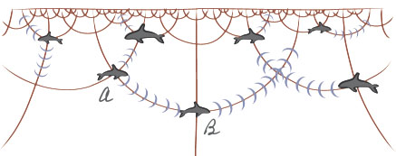

<!--https://gomakethings.com/detecting-click-events-on-svgs-with-vanilla-js-event-delegation/-->
<!-- <!DOCTYPE html> -->
<!-- <meta charset='UTF-8'> -->
<!-- <html> -->
    
<!-- <body> -->
# Whalesong

I first heard that whales experience non-euclidian geometry at the splendid
['The non-Euclidian geometry of whales and ants'](https://static01.nyt.com/images/blogs/wordplay/Universe_in_Zero_Words_Copyright.pdf).
It set of a cascade of thoughts, along the lines of ['what is it like to be a bat'](https://warwick.ac.uk/fac/cross_fac/iatl/study/ugmodules/humananimalstudies/lectures/32/nagel_bat.pdf). 
I find it pleasurable to attempt to perceive the world as these beings might,
whose perception of the world is so non-Euclidian. So I set off to learn
more, and hopefully try and simulate this phenomena to get a better
intuition for it.

It's djikstras on a graph, where the edge lengths are obtained by discretizing
hyperbolic space so the single-source shortest paths discovered by djikstras is
a reasonable approximation of the real shortest paths in hyperbolic space Ah,
so the physics is that due to (i) snells law, (ii) changing refractive index
due to depth, sound "bends" inside water, leading to the shortest paths of
sound inside water to be those circular arcs plotted above. So you can consider
the paths that sound travels in space as hyperbolic space. If this is the only
sense organ whales have, then whales perceive the world as hyperbolic space.

<!-- </body> -->

    
</html>
